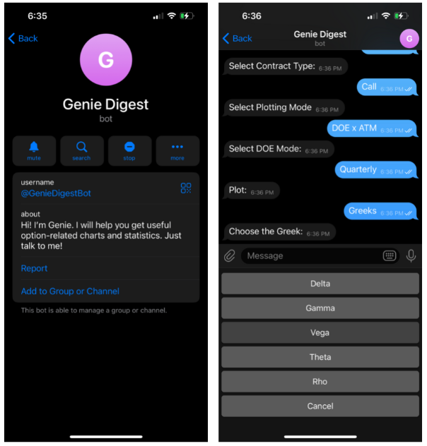
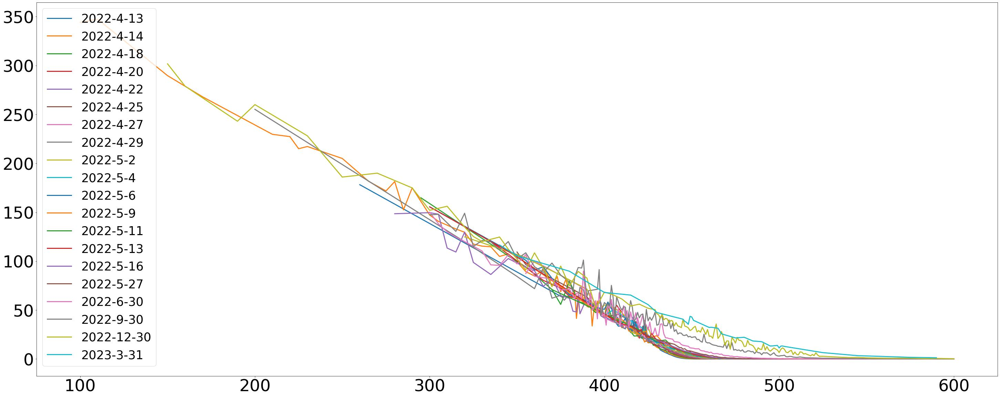
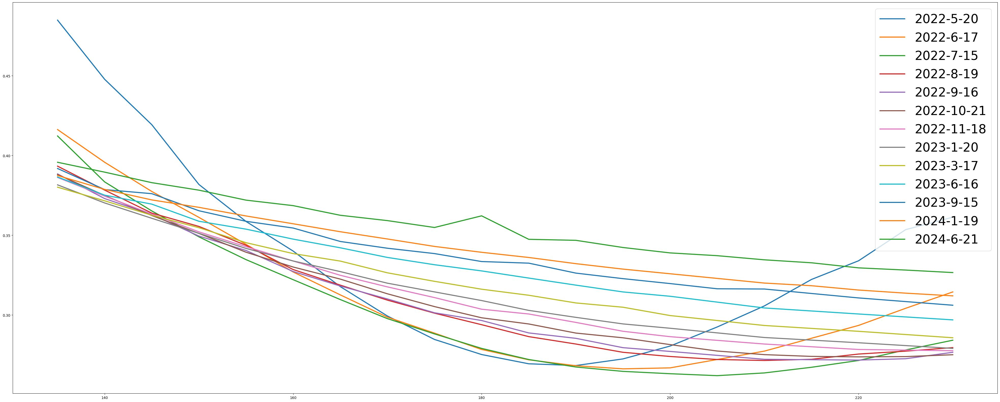
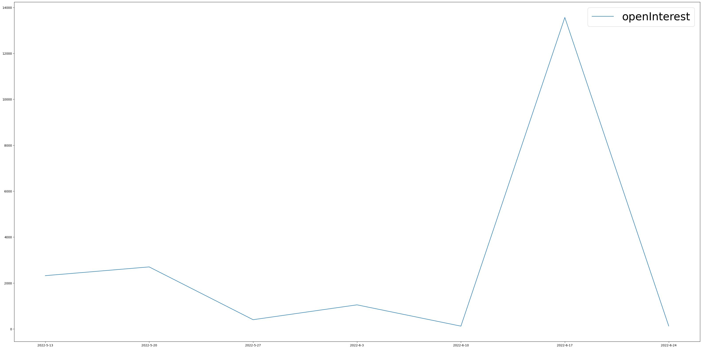
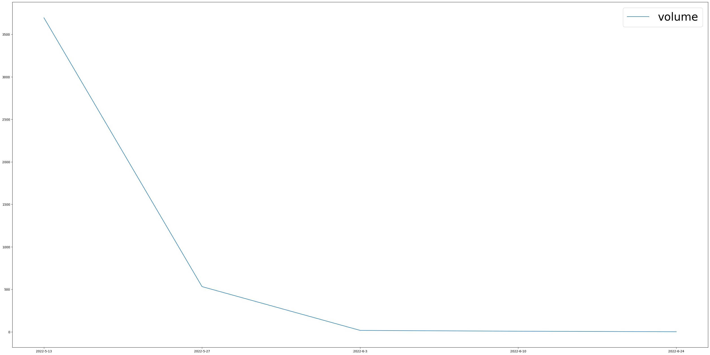

# Geenie-Digest

Geenie produces charts and pulls useful information from the vast derivatives market. All at your request.

|  |  |
|:--:| :--:|
| Menu Screens | Preview |

### What kind of Charts can Geenie provide?

#### I. Strike Range * DOE (Strike Range * # of DOE curves)
Choose a range of strike prices and a number of Expiration Dates. 
Geenie will produce the chosen metrics for each Expiration Date (in the given range).
 

#### II. ATM x DOE (Range, Exact Date, Weeklys, Quarterlys / Regular)
Choose a number of Expiration Dates to get ATM data plotted. 

(LINK) See interaction tree

# Technical Overview:

## Project Directory
<pre>
├── Data
├── Demo_Assets
├── Images
├── src
│   ├── Bot
│   ├── Notebooks
│   ├── Pricing
│   ├── Requests
│   └── errors.py
└── venv

</pre>

## Technical Architecture

- Request/Interaction Tree

- Data Retrieval & Dataset Construction

- Option Pricing

## Running the Bot

If you would like to run the Bot on your own device, follow the steps below:

### Setting Up Virtual Environment

Set up virtual environment:
pip3 install virtualenv

cd ..
virtualenv geenie-options
cd geenie-options

### Installing Dependencies

source venv/bin/activate

RUN: python3 -m pip install -r requirements.txt

deactivate when done

### Telegram Setup
Make a request to @bot_father and get an API_TOKEN / SECRET Key (LINK)

### Running the bot server
python3 src/Bot/bot_testing.py

## Known ISSUES/Bugs:

- Image / Font Scaling Consistensy (Especially for ATM x DOE mode)
- Single / Exact DOE chart representation
- Choosing Strikes / DOEs markup: Multiple instances of Strike prices and DOEs -> forgot a reset?
- Graceful handling absence of data (ex. No expirations within 60D chosen timeframe)

## What is next?

- Stats Feature is in development
- P/C mode for dual charts
- Use a proper server framework w/ HTTP requests (Flask?)
- Limit repetitive data requests & retrievals (Check if query already made in the same hr/4hr period/day?)
- Handle invalid tickers (Non 200 responses?)

- Logger Functionality
- Error Classes

